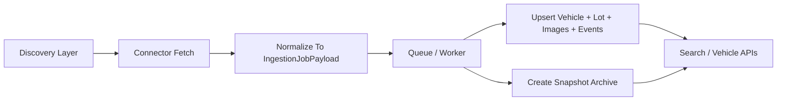

# IAAI Ingestion Architecture

## Goal

Give the platform a stable ingestion contract for both Copart and IAAI so we can plug in an official IAAI feed later without rewriting storage, snapshots, search, or vehicle pages.

## Current Decision

We treat `copart` and `iaai` as normalized provider codes everywhere in ingestion. Human-facing labels stay in the presentation layer.

## Core Principles

1. Archive first.
   As soon as we see an auction record, we save enough data to reconstruct the vehicle timeline later.
2. One lot schema, richer payload.
   `lots` stays generic, while provider-specific details live in the ingestion payload and snapshots.
3. Connector isolation.
   Discovery/fetch logic can change per provider, but normalization into `IngestionJobPayload` must stay stable.
4. Source-safe search.
   Search and lot resolution should work regardless of whether data came from Copart CSV, future IAAI feed, or a direct connector run.

## Target Flow

## Discovery Sources

### Copart
- Official CSV sales data
- Optional direct connector for targeted refreshes

### IAAI
- Future official buyer/data service feed
- Optional targeted lot refresh connector
- Optional discovery adapter for search/listing pages if the commercial path is delayed

The discovery layer is allowed to change. The storage contract should not.

## Normalized Ingestion Contract

`IngestionJobPayload` is now the stable contract between connectors and storage.

Required normalized fields:
- `provider`: `copart | iaai`
- `source`: same machine value as provider
- `vin`
- `lot_number`

Archive and traceability fields:
- `source_record_id`
- `source_url`
- `sale_date`
- `hammer_price_usd`
- `status`
- `location`

Vehicle-condition fields useful for IAAI:
- `title_brand`
- `primary_damage`
- `secondary_damage`
- `odometer`
- `run_and_drive`
- `keys_present`

Auction specification fields:
- `make`
- `model`
- `year`
- `trim`
- `series`
- `body_style`
- `engine`
- `transmission`
- `fuel_type`
- `drivetrain`
- `vehicle_type`
- `exterior_color`
- `interior_color`
- `cylinders`

Flexible provider-specific bucket:
- `attributes`

`attributes` should hold fields that are useful but not important enough to promote into first-class columns yet, for example:
- branch code
- sale document
- listing type
- currency
- lane / sequence
- loss type

## What Goes To SQL vs Snapshot

### SQL first-class lot fields
Keep using `lots` for cross-provider fields needed by search and UI:
- provider/source
- lot number
- VIN
- sale date
- hammer price
- status
- location
- fetched timestamp

### Snapshot payload
Keep provider-specific richness in `lot_import_snapshots.payload_json`:
- source URL
- source record id
- title data
- damage fields
- odometer
- auction trim and equipment fields
- provider-specific attributes
- any future raw or semi-normalized data points

This gives us historical depth without forcing a migration every time IAAI exposes a new field.

## IAAI Connector Modes

### `mock`
Used in development and demos.

### `official`
Expected long-term production path.

Expected responsibilities:
- fetch one lot by VIN or lot number
- normalize into `IngestionJobPayload`
- provide stable `source_record_id`
- capture `source_url` when available
- map IAAI-specific fields into first-class payload fields + `attributes`

### Future optional `discovery`
If we later add a listing/page discovery adapter, it should:
- discover lot identifiers
- enqueue targeted lot refresh jobs
- avoid writing directly to SQL

That keeps the normalization pipeline single-path.

## Provider Normalization Rules

Always store machine values in ingestion/storage:
- `copart`
- `iaai`

Never store these as lot source values:
- `Copart`
- `IAAI`
- public masking labels such as `market`

Public masking belongs only in response formatting.

## Why This Helps Search

Search already extracts provider hints from URLs:
- Copart -> `copart`
- IAAI / Impact -> `iaai`

By normalizing stored lot sources to lowercase machine values, lot lookup becomes deterministic.

## Migration Strategy

No DB migration is required for the first IAAI architecture pass because:
- existing relational models are already generic enough
- richer IAAI fields live in snapshots and payloads

Possible future migrations:
1. add dedicated lot columns for fields that become product-critical across providers
2. add per-provider lineage tables if we ingest multiple upstream feeds per provider
3. add raw payload storage if we need auditing/debug parity with a commercial feed

## Recommended Next Steps

1. Stand up production worker + scheduler so Copart continuously fills the archive.
2. Add an IAAI connector adapter that returns the enriched payload contract.
3. Add admin diagnostics showing `provider`, `source_record_id`, and key IAAI attributes from snapshots.
4. If IAAI access is obtained, implement `official` mode first before building any page discovery fallback.
